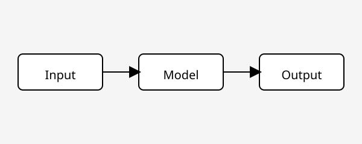

This is the first post, mostly to confirm that code, math, and images all render
correctly before writing anything real.

## Code

Syntax highlighting and a copy button come for free:

```python
def softmax(logits: list[float]) -> list[float]:
    exps = [pow(2.718281828, x) for x in logits]
    total = sum(exps)
    return [e / total for e in exps]
```

Inline code like `pip install torch` works too.

## Math

Inline math: the attention score is $\text{softmax}\left(\frac{QK^\top}{\sqrt{d_k}}\right)V$.

Display math:

$$
P(w_t \mid w_{<t}) = \frac{\exp(z_t)}{\sum_{i=1}^{|V|} \exp(z_i)}
$$

## Images



That covers the basics — code, equations, and images all in one post.
